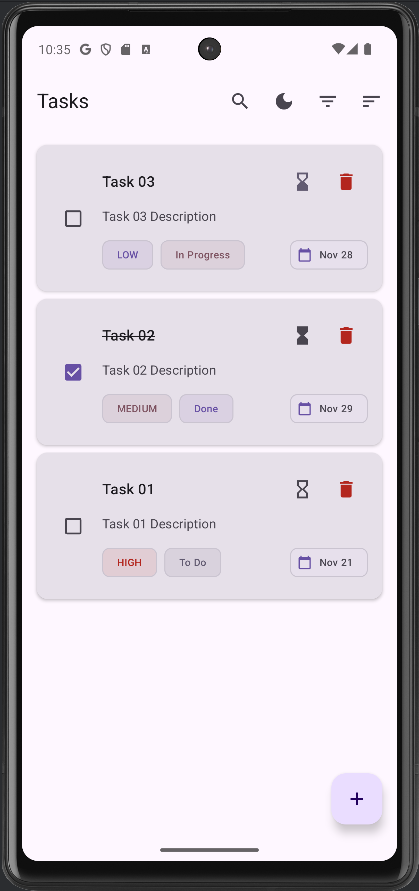
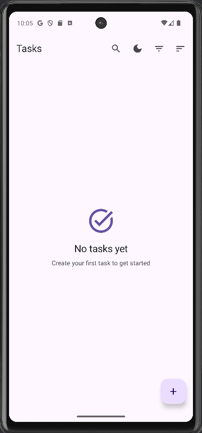
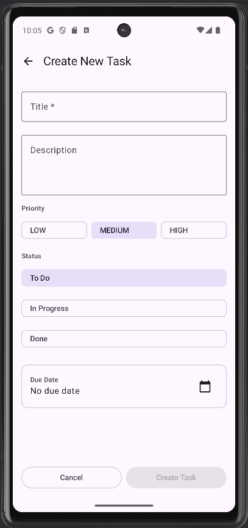
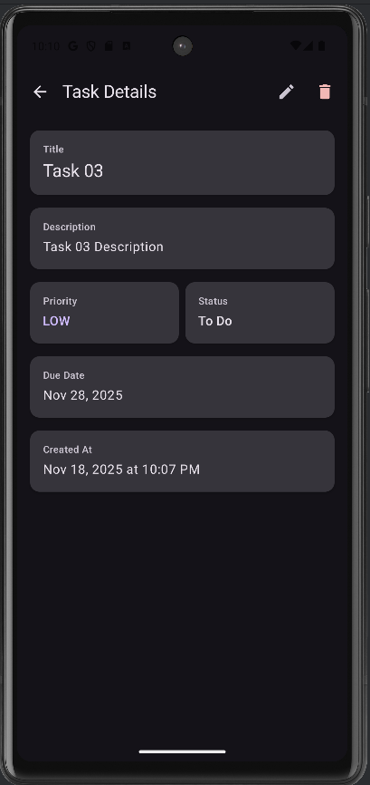
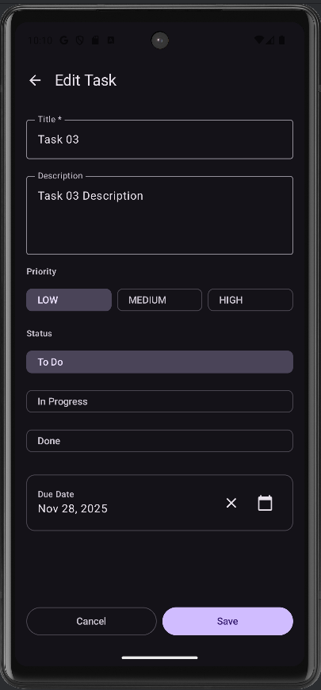
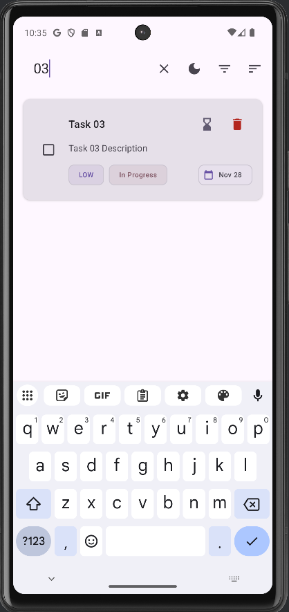
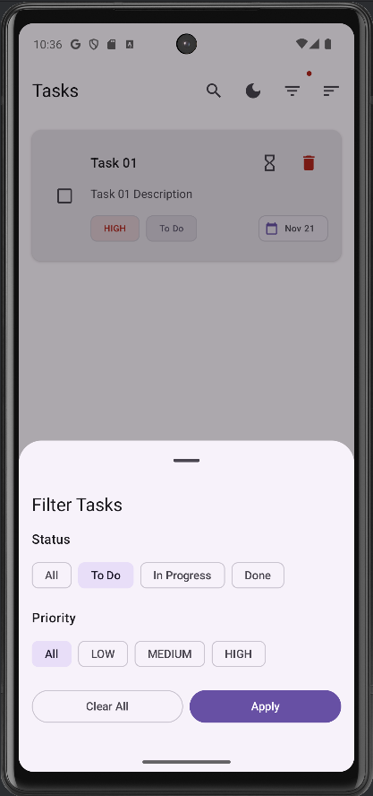
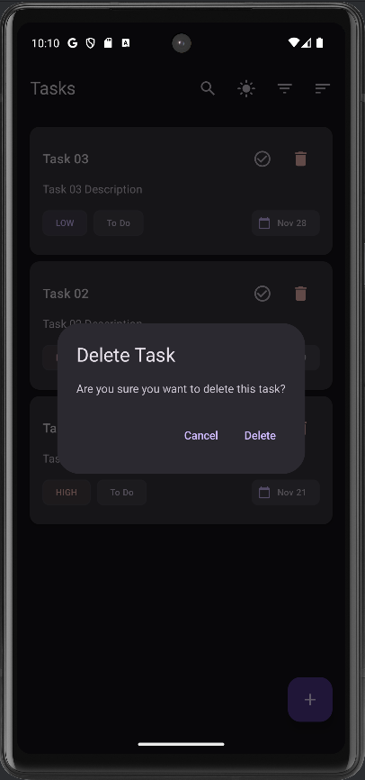
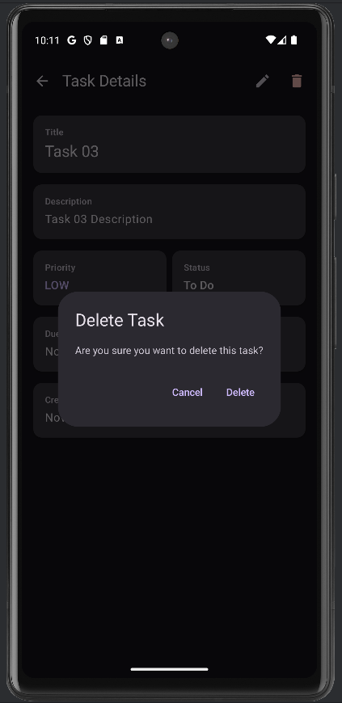

# TaskMan - Task Management Application

A modern Task Management application built with **Kotlin Multiplatform Mobile (KMM)** featuring shared business logic and native Android UI with offline-first architecture.

## Download the APK: [Releases](https://github.com/aaditx23/TaskMan/releases)


## Features

### Core Functionality
- ✅ **Create, Read, Update, Delete** tasks
- 📝 **Task Properties:**
  - Title (required)
  - Description (optional)
  - Priority: Low, Medium, High
  - Status: To Do, In Progress, Done
  - Due date (optional)
  - Created timestamp

### User Experience
- 🔍 **Search** tasks by title
- 🎯 **Filter** by status and priority
- 📊 **Sort** by date, priority, status, or title
- 💾 **Offline support** with local data persistence
- 🌓 **Dark/Light theme** support
- 📱 **Clean Material Design 3 UI**

## Screenshots

### Task List & Management

| List View | Empty State | Create Task |
|-----------|-------------|-------------|
|  |  |  |

### Task Details & Editing

| Task Details | Edit Task |
|--------------|-----------|
|  |  |

### Search, Filter & Sort

| Search | Filter | Sort |
|--------|--------|------|
|  |  |  |

### Delete Operations

| Delete from List | Delete from Details |
|------------------|---------------------|
|  |  |

## Tech Stack

- **Kotlin Multiplatform Mobile (KMM)** - Shared business logic
- **Jetpack Compose** - Modern declarative UI
- **Room Database** - Local data persistence
- **Voyager** - Navigation library
- **Material Design 3** - UI components
## Architecture

The app follows a clean architecture pattern with:
- **Domain Layer:** Task models and business logic (shared)
- **Data Layer:** Repository pattern with Room database
- **Presentation Layer:** MVVM with ScreenModels and Compose UI


## Build and Run

### Prerequisites
- Android Studio
- JDK 17 or later
- Android SDK

### Build Android App

```bash
# On macOS/Linux
./gradlew :composeApp:assembleDebug

# On Windows
.\gradlew.bat :composeApp:assembleDebug
```

### Run on Device/Emulator
Open the project in Android Studio and click **Run** or use:
```bash
./gradlew :composeApp:installDebug
```

